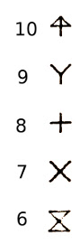
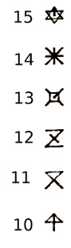

# The Apple 401 Color Plotter

## General concepts

The way the 401 interprets a coordinate at any given time depends on the current
viewport and window settings. The "viewport" is a rectangle specified in hardware
absolute coordinates and defines the physical area in which coordinates are resolved.
The "window" defines the virtual coordinates of the drawing area, which are then
mapped to the viewport.

Commands sent to the 401 are terminated by the ASCII "end of text" delimiter, 0x03.

### Serial connection

The 8 DIP switches (SW1-SW8) on the back of the plotter are used to configure the
serial interface.

SW1 selects the data bits. ON = 7 bits, OFF = 8 bits.

SW2 selects whether parity is used. ON = no parity bit, OFF = use a parity bit.
If parity is selected, SW3 determines the type of parity bit. ON = odd parity,
OFF = even parity.

SW4 and SW5 select the number of stop bits:
| SW4  | SW5  |  Stop bits    |
|------|------|---------------|
| OFF  | OFF  | 2 stop bits   |
| ON   | OFF  | 1.5 stop bits |
| OFF  | ON   | 1 stop bit    |
| ON   | ON   | invalid       |

SW6, SW7, and SW8 select the baud rate:
| SW6 | SW7 | SW8 | Baud       |
|-----|-----|-----|------------|
| OFF | OFF | OFF |  75 baud   |
| OFF | OFF | ON  | 150 baud   |
| OFF | ON  | OFF | 300 baud   |
| OFF | ON  | ON  | 600 baud   |
| ON  | OFF | OFF | 1200 baud  |
| ON  | OFF | ON  | 2400 baud  |
| ON  | ON  | OFF | 4800 baud  |
| ON  | ON  | ON  | 9600 baud  |

**The 401 uses hardware handshaking.** It never returns data to the computer
over the serial line and sets DSR when its internal buffer is full. Sending even
one byte after the DSR line has been set will corrupt the 401's command buffer
and trigger an error. Most USB to RS232 cables will attempt to bundle up several
bytes before transmission, so unless you're sure that your cable can handle it
I recommend flushing the serial connection after every byte and checking the DSR
line yourself.

## Command Reference

### Move Absolute (MA)

```
MAx,y
```

Raise the pen and move the plotter head to the position specified by the x,y coordinates.

Params: 2

### Move relative (MR)

```
MRx,y
```

Raise the pen and move the plotter head to a position offset x,y from its
current position.

Params: 2

### Draw absolute (DA)

```
DAx,y(,x,y..)
```

Lower the pen and draw a line from the current position to the position
specified by the x,y coordinates. If more than one coordinate pair is 
specified, continues to draw lines to the subsequent points as well.

Params: 2(+2*n)

### Draw relative (DR)

```
DRx,y(,x,y..)
```

Lower the pen and draw a line from the current position to the position
offset x,y for its current position. If more than one coordinate pair is 
specified, continues to draw lines to the subsequent offset points as well.

Params: 2(+2*n)

### Circle (CA)

```
CAr,x,y
```

Lower the pen and draw a circle of radius r centered at x,y.

Params: 3

### Letter size (LS)

```
LSs
```

Sets the font size to s (?? in what units? relative to what system of coordinates? ??)

Params: 1

### Letter rotation (LR)

```
LRθ
```

Sets the angle to draw subsequent text at θ degrees clockwise.

Params: 1

### Print letters (PL)

```
PLtext
```

Lower the pen and draw the specified text at the current position,
using the currently active letter size and rotation settings.

Params : 1 (string)

### Pen select (PS)

```
PSi
```

Select pen i (where i is in the range 1-4).

Params: 1

### Line type (LT)

```
LTn
```

Select the line style for subsequent draw operations. `n` is a value in the
range 1-9:

| n | Line style       |
|---|------------------|
| 1 | Solid            | 
| 2 | Dotted           | 
| 3 | Short dash       | 
| 4 | Medium dash      | 
| 5 | Long dash        | 
| 6 | Line w/ dots     | 
| 7 | Line w/ one short dash   | 
| 8 | Line w/ two dots         |
| 9 | Line w/ two short dashes |

Params: 1

### X-axis ticks (XT)

```
XTs,d,n,a,b
```

Draw an X axis with tick marks as specified. There are two "styles"
`s` of input available, which determine how the distance `d` parameter
is interpreted.

| parameter | function                              |
|-----------|---------------------------------------|
| s         | style                                 |
| d         | distance                              |
| n         | number of tick marks                  |
| a         | length of tick mark above the axis    |
| b         | length of tick mark below the axis    |

If the `s` parameter is set to 1, then the distance is interpreted as
the length of the entire axis. If `s` is set to 2, then the distance is
interpretes as the length of the space between adjacent tick marks.

Params: 5

### Y-axis ticks (YT)

```
YTs,d,n,a,b
```

Draw a Y axis with tick marks as specified. The parameters are handled
in the same manner as the `XT` command (see above).

Params: 5

### Clear/Reset (CH)

```
CH
```

Raise the pen and move the plotter head to its original position; usually used
at the end of a plot.

Params: 0

### Point mark (PM)

```
PMt
```

Draw a marker at the current position. The marker type is specified by the `t`
parameter. The marker size is determined by the font size setting specified by the
`LS` command; consider the markers as just special characters.

The various marker shapes are illustrated in the images below.

  

Params: 1

### Pen velocity (PV)

```
PVv
```

Sets the drawing velocity `v`, on a scale of 1-10, where 1 is slowest, 10 is fastest.
The default speed is 10.

Params: 1

### Slant lettering (SL)

```
SLθ
```

Slants subsequent text by an angle specified by `θ` degrees.

Params: 1

### Viewport (VP)
VP - Viewport - 4 params

### Window (WD)
WD - window - 4 params

### Reset (RS)

```
RS
```

Resets the error bit. If the error LED is lit, it should be extinguished.

RS will apparently accept some parameters, but it's unknown if this does anything.

Params: 0 or 1

AC - arc - 5 params
LI - ??? - no params/arb ???
IM - ??? - 2 params
PK - ??? - no params/arb
UL - ??? - no params/arb ? 1 param 0-9?
SP - ??? - 1 param ??
LF - ??? - 1 param ? 0-9

