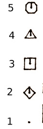

# The Apple 410 Color Plotter

## Quick introduction and apology

Everything below (other than the dip switch settings) was sussed out by
ripping the ROM, extracting the self-test script and the command lookup table, and 
trial and error. Now that the manual is included in this folder, this could possibly
be updated.

## General concepts

The way the 401 interprets a coordinate at any given time depends on the current
viewport and window settings. The "viewport" is a rectangle specified in hardware
absolute coordinates and defines the physical area in which coordinates are resolved.
The "window" defines the virtual coordinates of the drawing area, which are then
mapped to the viewport.

All drawing operations are clipped to the current viewport and window; parts of
arcs, circles, lines, etc. that would be rendered outside the viewport are not
drawn.

If the size of the window has a different aspect ratio than the size of the viewport,
the elements drawn will be stretched to fit. You can use this mechanism to draw ellipses
or stretched text.

Commands sent to the 401 are terminated by the ASCII "end of text" delimiter, 0x03.
A semicolon or newline may also be used in some situations; however it's safest to
terminate a text-writing command (PL) with 0x03.

## Units

The base units for the viewport (as used in the VP command) are approximately 1 unit
= 0.1mm.  (In practice, this is slightly off, so I don't recommend drawing any rulers
with this machine.)

### Serial connection

The 8 DIP switches (SW1-SW8) on the back of the plotter are used to configure the
serial interface.

SW1 selects the data bits. ON = 7 bits, OFF = 8 bits.

SW2 selects whether parity is used. ON = no parity bit, OFF = use a parity bit.
If parity is selected, SW3 determines the type of parity bit. ON = odd parity,
OFF = even parity.

SW4 and SW5 select the number of stop bits:

| SW4  | SW5  |  Stop bits    |
|------|------|---------------|
| OFF  | OFF  | 2 stop bits   |
| ON   | OFF  | 1.5 stop bits |
| OFF  | ON   | 1 stop bit    |
| ON   | ON   | invalid       |

SW6, SW7, and SW8 select the baud rate:

| SW6 | SW7 | SW8 | Baud       |
|-----|-----|-----|------------|
| OFF | OFF | OFF |  75 baud   |
| OFF | OFF | ON  | 150 baud   |
| OFF | ON  | OFF | 300 baud   |
| OFF | ON  | ON  | 600 baud   |
| ON  | OFF | OFF | 1200 baud  |
| ON  | OFF | ON  | 2400 baud  |
| ON  | ON  | OFF | 4800 baud  |
| ON  | ON  | ON  | 9600 baud  |

**The 401 uses hardware handshaking.** It never returns data to the computer
over the serial line and sets DSR when its internal buffer is full. Sending even
one byte after the DSR line has been set will corrupt the 401's command buffer
and trigger an error. Most USB to RS232 cables will attempt to bundle up several
bytes before transmission, so unless you're sure that your cable can handle it
I recommend flushing the serial connection after every byte and checking the DSR
line yourself.

## Command Reference

### Move Absolute (MA)

```
MAx,y
```

Raise the pen and move the plotter head to the position specified by the x,y coordinates.

Params: 2

### Move relative (MR)

```
MRx,y
```

Raise the pen and move the plotter head to a position offset x,y from its
current position.

Params: 2

### Draw absolute (DA)

```
DAx,y(,x,y..)
```

Lower the pen and draw a line from the current position to the position
specified by the x,y coordinates. If more than one coordinate pair is 
specified, continues to draw lines to the subsequent points as well.

Params: 2(+2*n)

### Draw relative (DR)

```
DRx,y(,x,y..)
```

Lower the pen and draw a line from the current position to the position
offset x,y for its current position. If more than one coordinate pair is 
specified, continues to draw lines to the subsequent offset points as well.

Params: 2(+2*n)

### Circle (CA)

```
CAr(,x,y)
```

Lower the pen and draw a circle of radius r centered at x,y. If x,y are not
specified the circle will be centered at the current position.

Params: 1 or 3

### Letter Initialize (LI)

```
LI
```

Reset the text format.

### Letter size (LS)

```
LSs
```

Sets the font size to s (?? in what units? relative to what system of coordinates? ??)

Params: 1

### Letter rotation (LR)

```
LRθ
```

Sets the angle to draw subsequent text at θ degrees clockwise.

Params: 1

### Print letters (PL)

```
PLtext
```

Lower the pen and draw the specified text at the current position,
using the currently active letter size and rotation settings.

Params : 1 (string)

### Pen select (PS)

```
PSi
```

Select pen i (where i is in the range 1-4).

Params: 1

### Line type (LT)

```
LTp(,k)
```

Select the line style for subsequent draw operations. `p` is a value in the
range 1-9:

| n | Line style       |
|---|------------------|
| 0 | Custom pattern (see UL) |
| 1 | Solid            | 
| 2 | Dotted           | 
| 3 | Short dash       | 
| 4 | Medium dash      | 
| 5 | Long dash        | 
| 6 | Line w/ dots     | 
| 7 | Line w/ one short dash   | 
| 8 | Line w/ two dots         |
| 9 | Line w/ two short dashes |

`k` specifies the repeat length in mesurement units. The default is 100, but the value will persist.

Params: 1 or 2

```
ULd1,m1(,d2,m3,..d6,m6)
```

Create a custom pattern for use with subsequent LT0 operations.

`d` specifies a draw length, `m` specifies a move length.


### X-axis ticks (XT)

```
XTs,d,n,a,b
```

Draw an X axis with tick marks as specified. There are two "styles"
`s` of input available, which determine how the distance `d` parameter
is interpreted.

| parameter | function                              |
|-----------|---------------------------------------|
| s         | style                                 |
| d         | distance                              |
| n         | number of tick marks                  |
| a         | length of tick mark above the axis    |
| b         | length of tick mark below the axis    |

The `s` parameter determines how the `d` parameter is interpreted and whether
the first tick mark (at the "0" point on the axis) is drawn or not:

| style parameter  |  description                        |
|------------------|-------------------------------------|
| 0                | d is distance between ticks         |
| 1                | d is total length of axis           |
| 2                | d is distance between ticks, first tick mark is not drawn |
| 3                | d is total length of axis, first tick mark is not drawn |

Params: 5

### Y-axis ticks (YT)

```
YTs,d,n,a,b
```

Draw a Y axis with tick marks as specified. The parameters are handled
in the same manner as the `XT` command (see above).

Params: 5

### Clear/Reset (CH)

```
CH
```

Raise the pen and move the plotter head to its original position; usually used
at the end of a plot.

Params: 0

### Point mark (PM)

```
PMt
```

Draw a marker at the current position. The marker type is specified by the `t`
parameter. The marker size is determined by the font size setting specified by the
`LS` command; consider the markers as just special characters.

The various marker shapes are illustrated in the images below.

  

Params: 1

### Pen velocity (PV)

```
PVv
```

Sets the drawing velocity `v`, on a scale of 1-10, where 1 is slowest, 10 is fastest.
The default speed is 10.

Params: 1

### Slant lettering (SL)

```
SLθ
```

Slants subsequent text by an angle specified by `θ` degrees.

Params: 1

### Viewport (VP)

```
VPx1,y1,x2,y2
```

Specifies the viewport area, in absolute coordinates, to draw in. See the introduction
for an explanation of how the viewport is used. `x1,y1` specify the upper left hand corner
of the viewport; `x2,y2` specify the lower right hand of the viewport.

Params: 4

### Window (WD)

```
WDx1,y1,x2,y2
```

The window into which to draw. See the introduction for an explanation of how the window
is used. `x1,y1` specify the upper left hand corner
of the window; `x2,y2` specify the lower right hand of the window.

Params: 4

### Reset (RS)

```
RS
```

Resets the error bit. If the error LED is lit, it should be extinguished.

RS will apparently accept some parameters, but it's unknown if this does anything.

Params: 0 or 1

### Arc (AC)

```
ACr,θ1,θ2(,x,y)
```

Draws a circular arc of radius `r` from `θ1` to `θ2`. If x,y are specified, they
determined the center of the arc's circle. If they are not specified, the current
position is considered to be the center of the arc's circle.

After the arc is drawn, the endpoint of the arc is considered to be the new position.

Params: 3 or 5

### Error action (IM)

```
IMa(,b)
```

Selecting error action

`a` specifies the mode: 0 = turn on error light; 64 = reject commands ; 192 = write message.

| a | Mode       |
|---|------------------|
| 0 | Turn on error light |
| 64 | Reject command      | 
| 192 | Write error message | 

Do note that "write message" does not mean to send a response over the serial port; it means
that it will literally write the error message out on the plotter.

`b` specifies the errors to filter. Default is 31.

| a | Error type       |
|---|------------------|
|  1 | Command not recognized |
|  2 | Numbers outside range  | 
|  4 | Not enough numbers for command | 
|  8 | Bad syntax       |
| 16 | Pen would go outside window    | 

### Size Paper (SP)

```SPn```

Sets the current paper size. This is essentially a preset "VP" command. The table below of
drawing area sizes is approximate, based on measuring a rectangle drawn at the extent of the
entire viewport.

| n | measurement (in mm) |
|---|---------------------|
| 0 | 241 x 175           |
| 1 | 178 x 240 |
| 2 | 394 x 240 |
| 3 | 282 x 280(?) |
| 4 | 259 x 170 |
| 5 | 171 x 280(?) |
| 6 | 326 x 217 |
| 7 | 218 x 142 |
| 8 | 143 x 217 |

## Unknown commands

PK - ??? - no params/arb (Not in user reference)

LF - ??? - 1 param ? 0-9  Letter Font

